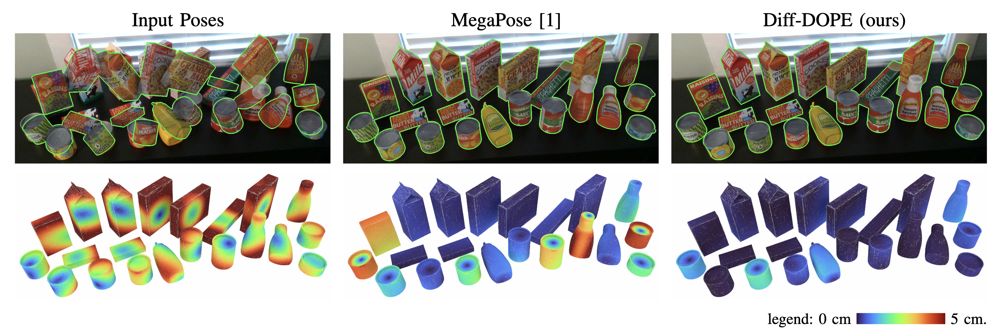
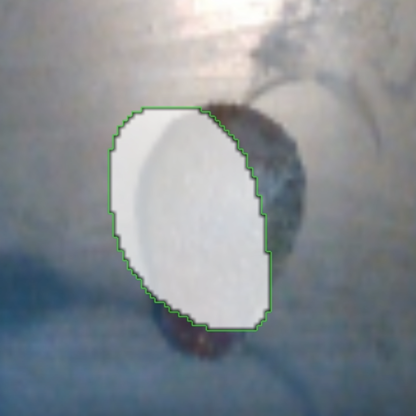
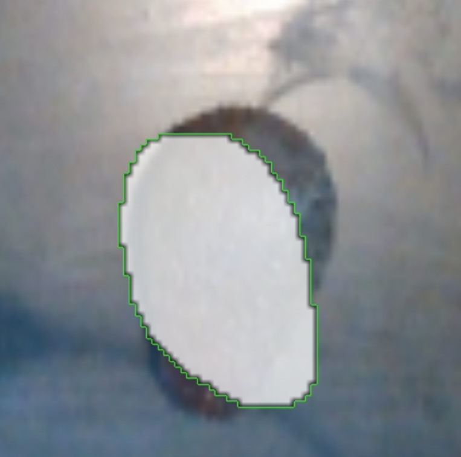
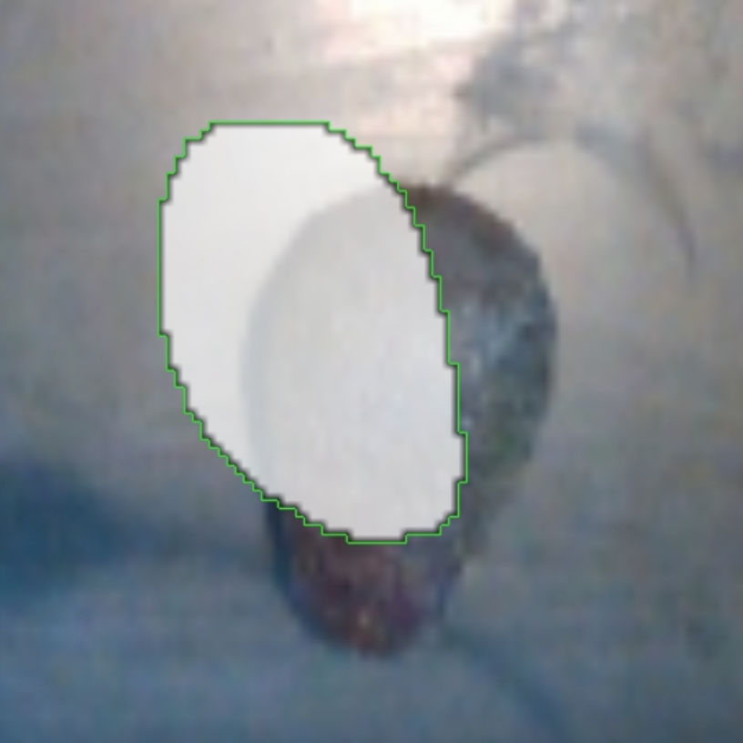
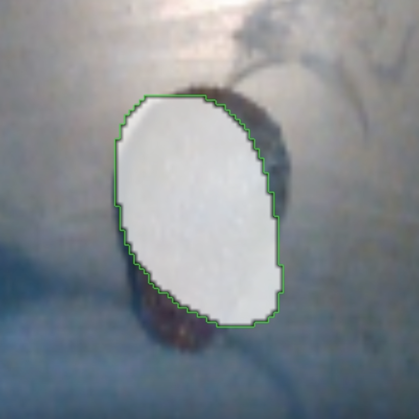
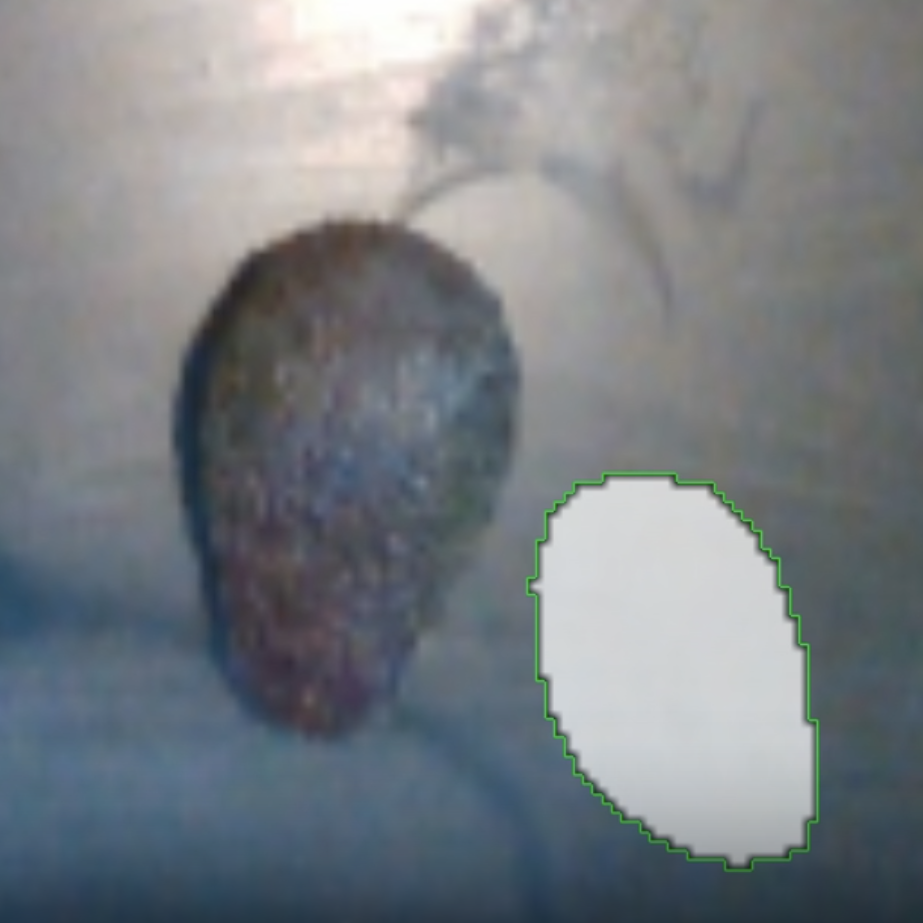
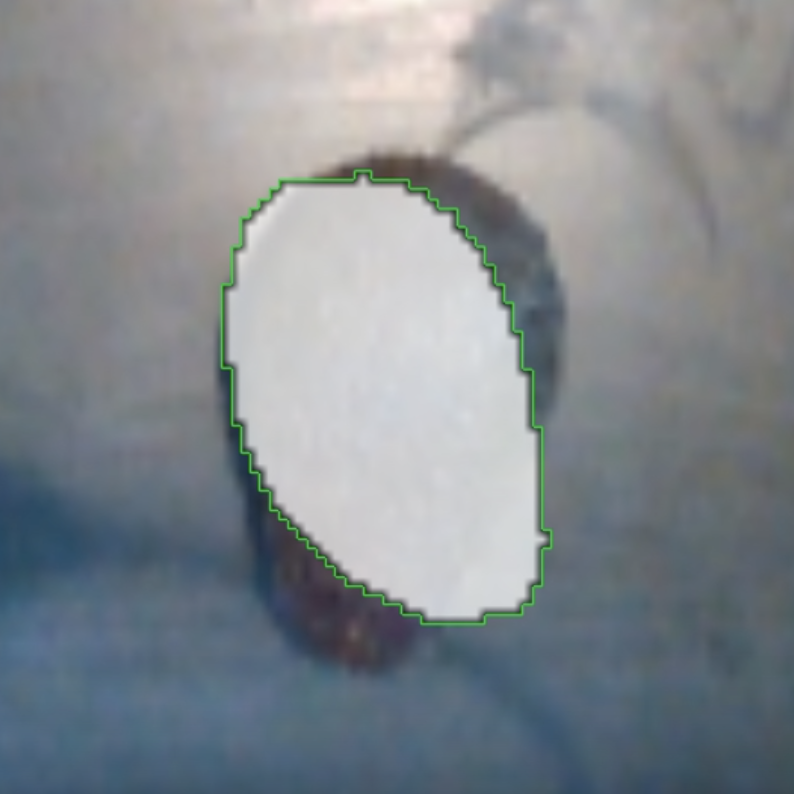

# Diff-DOPE



## Overview

Diff-DOPE is a sophisticated 6-DoF pose refinement tool that utilizes a differentiable renderer to minimize re-projection errors across various modalities such as RGB, depth, edge detection, and masking. This method, when provided with an image, a 3D model, and an initial pose estimation, computes the corrected object pose with enhanced accuracy.

## Application and Evaluation

Objective: Diff-DOPE was evaluated to assess its effectiveness as a global pose correction system, intended to augment foundational pose estimations where initial results lack precision.

## Experimental Setup

The method was tested under three distinct conditions, characterized by varying levels of input noise:

Low input noise

<p style="display: flex; align-items: center; justify-content: space-around;">
  
  
</p>

Medium input noise

<p style="display: flex; align-items: center; justify-content: space-around;">
  
  
</p>

High input noise

<p style="display: flex; align-items: center; justify-content: space-around;">
  
  
</p>

### Findings

The technique demonstrates robustness in recovering object position under significant noise conditions, as illustrated with an avocado model. Despite this, there are challenges in attaining precise pose alignment, particularly due to assumptions and constraints inherent in the experimental framework:

1. Model-Specific Limitations: The method assumes the availability of an exact mesh model of the target object. In practical scenarios, such as with avocados or other variably shaped produce, this assumption does not hold due to natural differences in shape and size. This discrepancy adversely affects the resolution of pose correction.

2. Mesh Completeness: The algorithm depends on comprehensive 360-degree scans of objects. However, inconsistencies in the 3D mesh (such as missing data points) and natural variance among individual items complicate the alignment process, particularly when matching to segmentation masks.

## Performance Analysis

During trials, the pose refinement process required up to 4 seconds per frame, which was optimized to 2 seconds after parameter adjustments. Nevertheless, this latency exceeds the operational requirement of less than 200 ms per frame for real-time applications. This limitation challenges the feasibility of Diff-DOPE as a regular or even intermittent global pose correction solution in high-throughput settings.

## Conclusion

While Diff-DOPE exhibits potential in refining pose estimations where foundational algorithms falter, the current implementation's performance metrics and operational constraints limit its practicality for real-time applications. Further optimization and model adaptation are essential for deployment in dynamic environments typical of robotic operations involving varied and irregular objects.

  ## Installation
```bash
conda create -n diffdope python=3.9
conda activate diffdope
pip install -e .
```

## Run simple scene
From the root folder of the this repository, call:
```bash
python examples/simple_scene.py
```
The first run will compile several CUDA kernels, which will take a brief amount of time. Subsequent runs will be faster. After the script finishes, you should see the resulting object pose displayed as a matrix, as well as a filename for a video animation of the optimization process.